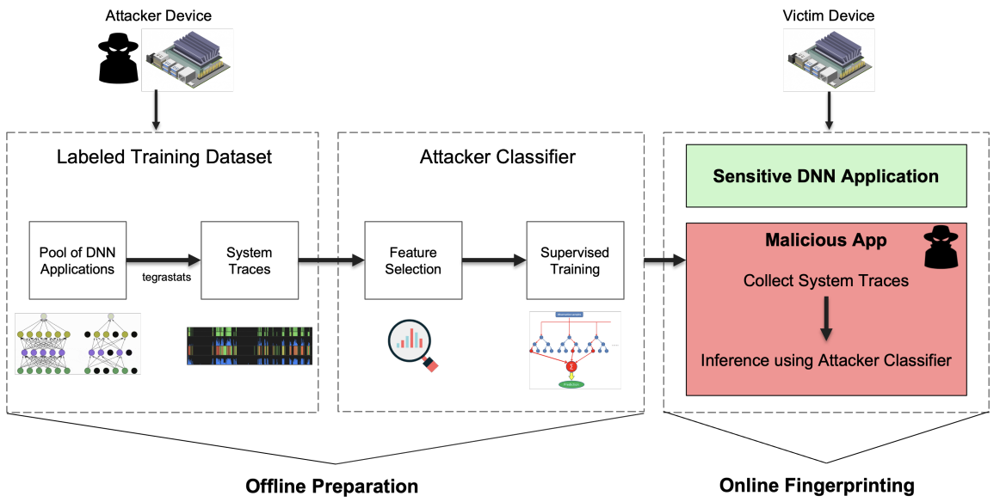

# DNN Model Architecture Fingerprinting Attack on CPU-GPU Edge Devices [EuroS&P 2022]

[[`Paper`](https://www.computer.org/csdl/proceedings-article/euros&p/2022/161400a337/1ErpG7FwUms)] [[`BibTeX`](#citation)]

<h1 align="center"> 
    
</h1>

## System Requirements

### Model Fingerprinting (on Jetson)
- NVIDIA Jetson device is required to run `tegrastats` to collect system traces.
- Install [Pytorch v1.7+](https://forums.developer.nvidia.com/t/pytorch-for-jetson-version-1-10-now-available/72048), [TensorFlow 2.x](https://docs.nvidia.com/deeplearning/frameworks/install-tf-jetson-platform/index.html) on Jetson Device
- Python3.6

### Adversarial Attack
- Python 3.8
- Tensorflow 2.x
- [Adversarial Robustness Toolkit (ART)](https://github.com/Trusted-AI/adversarial-robustness-toolbox)

## Model Fingerprinting

We provide all necesary files and code for performing the DNN Model Fingerprinting Attack in `\Model_Fingerprinting` folder.

- `\models_x` contain the DNN inference pipelines for all models.
- `\scripts` constains the meta shell scripts runnable on Jetson devices to collect traces to build dataset.
- `\aes` contains the background AES encryption/Decryption algorithm, adapted from [HERMIT Benchmark Suite](https://github.com/ankurlimaye/HERMIT-BenchmarkSuite/tree/master/src)

## Adversarial Attack

We provide all necesary files and code for performing the Adversarial Attack in `\Adversarial_Attack` folder. There are three meta shell scripts to reproduce results:

- `train_all_cifar10_model_fing.sh` trains the given state-of-the-art popular DNN models on CIFAR10 dataset.
- `generate_adv_examples.sh` uses the ART library to generate and seperate the adversarial and benign examples for given models.
- `full_adv_attack.sh` combines generated examples into ensemble examples from families to feed into selected victim model.

## Contact
Kartik Patwari: [kpatwari@ucdavis.edu](kpatwari@ucdavis.edu)

## Citation
If you find our work useful, please consider giving a star and citation:
```bibtex
@inproceedings{patwari2022dnn,
  title={DNN model architecture fingerprinting attack on CPU-GPU edge devices},
  author={Patwari, Kartik and Hafiz, Syed Mahbub and Wang, Han and Homayoun, Houman and Shafiq, Zubair and Chuah, Chen-Nee},
  booktitle={2022 IEEE 7th European Symposium on Security and Privacy (EuroS\&P)},
  pages={337--355},
  year={2022},
  organization={IEEE}
}
